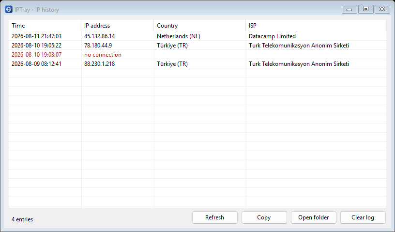
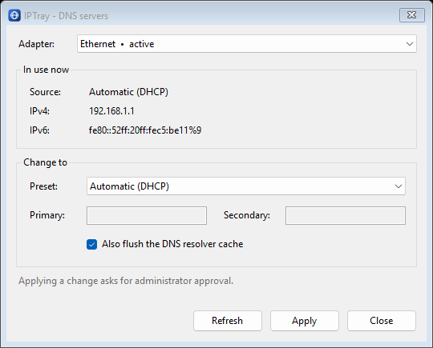

<h1 align="center">
  <br>
  IPTray
</h1>

<p align="center">
  A minimal Windows tray app that shows the public IP address you are currently seen as,
  using the flag of its country as the tray icon.
</p>

---

## What it does

- **Country flag as the tray icon.** The notification-area icon is the flag of the country your
  public IP belongs to. Flags are downloaded once and cached; the app falls back to a globe when
  the country is unknown, and adds a red badge when there is no connection.
- **Public IP at a glance.** Hover for a tooltip, or right-click for the address, the country and
  the ISP, with one click to copy the address.
- **Timestamped history.** Every change is appended to a CSV log. `IP history...` opens a window
  listing each address with the time it appeared, the country and the ISP.
- **DNS servers.** `DNS servers...` shows the IPv4 and IPv6 resolvers each connected adapter is
  using and whether they come from DHCP or are set statically, and lets you switch to a preset
  (Cloudflare, Google, Quad9, AdGuard, OpenDNS), enter your own, or go back to automatic.
- **Sensible refreshing.** Checks every 30 seconds to 15 minutes, your choice, and re-checks a few
  seconds after Windows reports a network change.
- Optional balloon notification on change, optional start with Windows, no account, no telemetry.

<p align="center">
  
  
</p>

## Install

Download `IPTray-1.0.1-setup.exe` from the
[latest release](https://github.com/memues/IPTray/releases/latest) and run it.

The installer offers a per-user install (no administrator rights needed) or an all-users install.
Nothing else is required: the .NET runtime is included in the package. If you care about the
tamper-resistance of a self-elevating app, prefer the all-users install — see
[SECURITY.md](SECURITY.md).

To remove it, use **Settings → Apps → Installed apps → IPTray**, or *Programs and Features*.
The uninstaller asks whether the settings and the IP history should be deleted too.

## Where things are stored

Everything lives under `%APPDATA%\IPTray`:

| File | Contents |
| --- | --- |
| `ip-log.csv` | The IP history, UTF-8 CSV, newest row last |
| `settings.json` | Check interval and the notification preference |
| `flags\` | Cached flag images |
| `error.log` | Only written if something goes wrong |

The "start with Windows" option is a single value under
`HKCU\Software\Microsoft\Windows\CurrentVersion\Run`, removed when you uninstall.

## How the public IP is resolved

Three providers are tried in order, so one being down, rate limited or blocked does not break the
app: [ipwho.is](https://ipwho.is), [ipapi.co](https://ipapi.co), then
[ipify](https://www.ipify.org) combined with [country.is](https://country.is). Country names come
from the .NET region database, so they read the same whichever provider answered.

## Changing DNS servers

IPTray itself runs without administrator rights. Applying a DNS change needs them, so the app
launches one elevated copy of itself that runs the `netsh interface ipv4 set dnsservers` commands
and reports the result back. You will see a single UAC prompt per change, and nothing happens if
you decline it. Reading the current configuration never needs elevation.

That elevated copy is the only place IPTray crosses a privilege boundary, so it is deliberately
narrow: it takes its instructions from its command line rather than from a file, validates every
argument itself, launches `netsh` by absolute path, and writes nothing to disk.
[SECURITY.md](SECURITY.md) explains the reasoning and lists the residual risks.

## Building from source

Requirements: [.NET 8 SDK](https://dotnet.microsoft.com/download/dotnet/8.0) and
[Inno Setup 6](https://jrsoftware.org/isinfo.php) (`winget install --id JRSoftware.InnoSetup`).

```cmd
build.cmd
```

This publishes a self-contained win-x64 build into `build\publish` and compiles the installer into
`build\installer`. To run it without packaging:

```cmd
dotnet run --project src\IPTray\IPTray.csproj
```

## Licence

[MIT](LICENSE)
